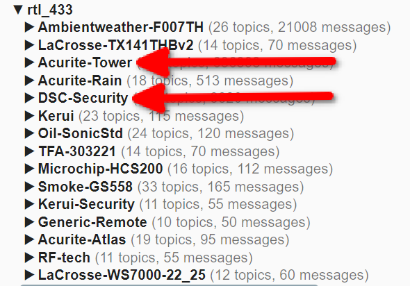

# Home Assistant Add-on: Rattler 433 (RTL_433)

## This add-on supports the creation of MQTT devices via MQTT Discovery.

## Installation

Follow these steps to get the add-on installed on your system:

1. Navigate in your Home Assistant frontend to **Supervisor** -> **Add-on Store**.
2. Ensure Mosquitto Broker is installed, it is required for this add-on to function.
3. Find the "Rattler 433" add-on and click it.
4. Click on the "INSTALL" button.

## How to use

The add-on has a couple of options available. To get the add-on running:

1. Start the add-on. The default settings should get you started.
2. Have some patience and wait a couple of minutes.
3. Configure any desired devices as shown below.

## Configuration

Add-on configuration:

```yaml
mqtt_prefix: rtl_433
ha_discovery_topic: homeassistant
retain: true
enable_internal_rtl433: true
customize: # Used for adding "Flex decoders" to rtl_433
  active: false
  folder: rattler
mqtt_host: "" # Default config will utilized HA OS Mosquitto Broker add-on
mqtt_port: 1883 # See above
mqtt_user: sdr # See above
mqtt_pass: "" # See above
devices: # See complete instructions below on how to create devices.
  - manufacturer: DSC-Security
    model: WS4904P
    name: Foyer Motion Sensor
    type: motion
    uid: "11111111"
  - manufacturer: DSC-Security
    model: WS4904P
    name: Basement Motion Sensor
    type: motion
    uid: "22222222"
```

### Option: `mqtt_prefix` (required)

This is the base topic prefix for publishing MQTT messages. It is required, and the default is rtl_433.

### Option: `ha_discovery_topic` (required)

This is the topic for publishing MQTT discovery messages. It is required, and the default is homeassistant.

### Option: `retain` (required)

Specify whether to retain messages or not. Retained messages are useful if you have devices which report infrequently. By using retained messages, whenever you restart Home Assistant, your entities will intialize with the values from the last retained message.

Can cause issues when used for devices such as the Sonoff RM433 8 button remote. Workaround decribed below. If you only use sensor devices, you can safely choose `true` here.

Default value: `true`

## Option: `enable_internal_rtl433`

Allows for disabling running of internal rtl_433. Device creation script still runs. Allows use of external rtl_433 instance.

Default value: `true`

### Option: `customize.active` (optional)

If set to `true` additional configuration files will be read, see the next option.

Default value: `false`

### Option: `customize.folder` (optional)

The folder to read the additional configuration files (`*.conf`) from. Folder will be located in the `/share` directory. Any files located in this folder will be appended to the end of the default configuration file. This can be used for extending the default configuration, or to alter default settings. Any config option duplicated in a file found in the customize folder will override the default setting. This is useful for adding things like "Flex decoders" to rtl_433.

Default value: `rattler`

### Option: `mqtt_host` (optional)

MQTT broker host address. Default is '', which will cause this add-on to automatically use the Mosquitto MQTT Broker add-on (if present).

### Option: `mqtt_port` (optional)

MQTT Broker port. Default is 1883.

### Option: `mqtt_user` (optional)

MQTT Username to use. If left blank, will automagically use the "addons" user.

### Option: `mqtt_pass` (optional)

MQTT Passwork to use. If left blank, will automagically use the "addons" user password.

## Option: `devices` (optional)

List of devices. Format is very specific, as shown below.

```yaml
- manufacturer: DSC-Security
  model: WS4904P
  name: Foyer Motion Sensor
  type: motion
  uid: "11111111"
- manufacturer: Acurite-Tower
  model: 06044M
  name: Living Room HT
  type: temp_c_hum
  channel: A
  id: "12345"
```

First is the `manufacturer`. This is NOT free-form. It must precisely match what is listed in MQTT Explorer for the device. For the examples above, you can get the manufacturer from MQTT Explorer like this:



Capitalization matter here, it MUST match precisely what is diplayed in MQTT Explorer, as this is used for generating the state topics in MQTT.

Next is `model`. This is free-form: you may enter whatever you like here.

Next is `name`. This is free-form: you may enter whatever you like here. This will be the name of the device in Home Assistant, and the base name for all the device entities.

Next is `type`. Again, this is NOT free-form. It must match precisely one of the following types: "motion", "contact", "glassbreak", "temp_c", "temp_f","temp_c_to_f", "temp_f_to_c", "temp_hum_c", "temp_hum_f", "temp_hum_c_to_f", "temp_hum_f_to_c", or "sonoff_remote". "temp_hum_c" is for sensors that report in °C and you want °C output. "temp_hum_f" is similar, but for °F. "temp_hum_c_to_f" and "temp_hum_f_to_c" similarly convert outputs, from °C from the sensor to °F in Home Assistant, and °F to °C as well.

Other devices may be added in the future, but presently, this is all that the MQTT Device Creator will handle.

Lastly are `uid` or `channel` & `id`. These are optional, however one must be specified per device, either simply `uid` or `channel` & `id` (both together). These may be obtained from MQTT Explorer. In the above example config, the DSC branded motion sensors use just the `uid`, while the AcuRite Tower temp/humidity sensors do not have a `uid` and instead they use the `channel` & `id`. No devices will use all 3, either just `uid` or `channel` & `id`.
